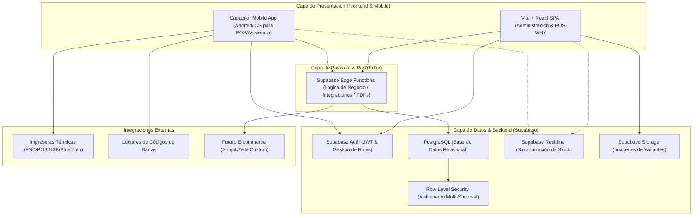
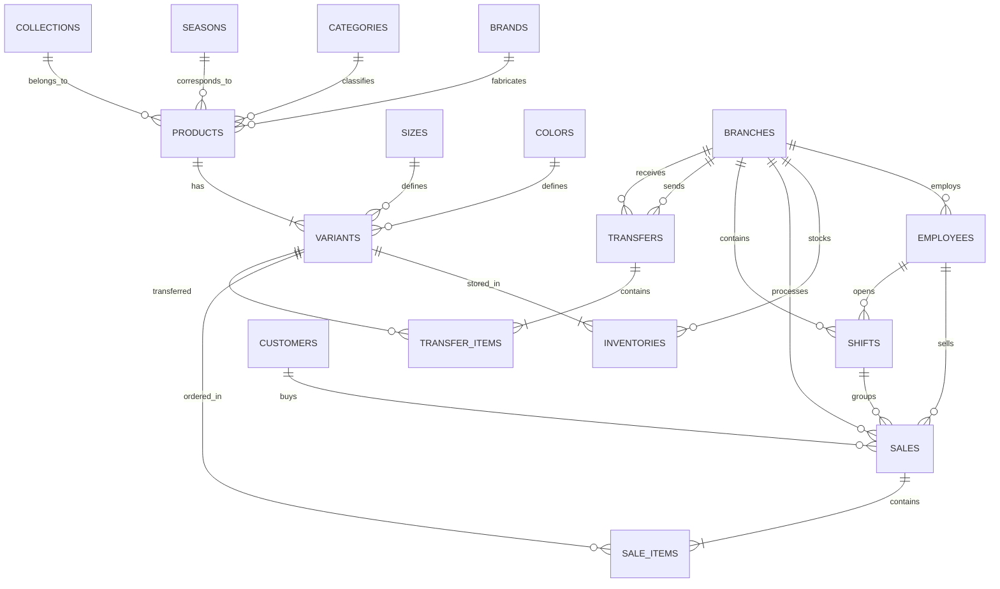
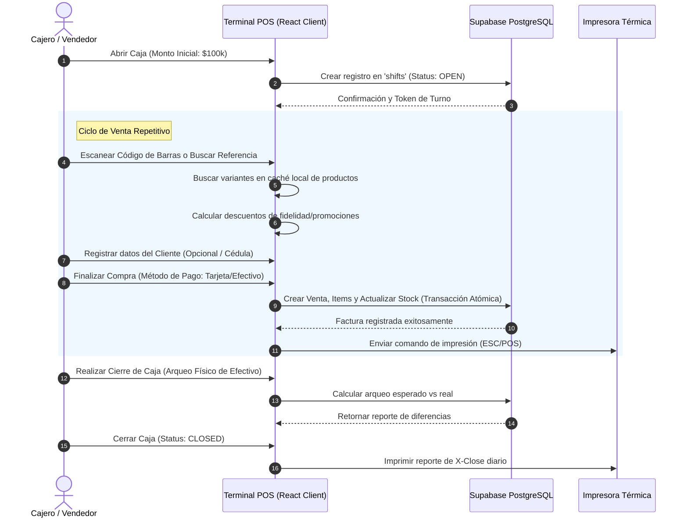

# Plan de Arquitectura y Especificaciones Técnicas: ERP/POS Fashion Retail

Este documento contiene la planeación técnica, diseño de base de datos, arquitectura de sistemas y el roadmap estratégico para el desarrollo de un ERP/POS moderno, robusto e independiente especializado en el sector de retail de ropa y moda. Este sistema está diseñado para operar con alto rendimiento en tiendas físicas (con soporte offline-first) y con una arquitectura lista para escalar hacia e-commerce omnicanal.

---

## 1. Análisis de Arquitectura

Se propone una **Arquitectura API-First Desacoplada y Orientada a Eventos**, garantizando independencia absoluta, alta escalabilidad y resiliencia ante caídas de conectividad.



### Principios Arquitectónicos Clave:
1. **Desacoplamiento Absoluto:** Sin dependencias externas a las indicadas; código limpio y modular bajo el principio de responsabilidad única.
2. **Offline-Resilient POS:** El Punto de Venta utilizará persistencia local en el cliente para permitir facturación fluida incluso si la conexión a internet es inestable, sincronizando las transacciones de manera asíncrona al recuperar la señal.
3. **Seguridad Nativa (Zero-Trust):** Cada tabla del sistema estará protegida por políticas RLS (Row-Level Security) de PostgreSQL, asegurando que un usuario de la sucursal X solo interactúe con datos autorizados para su rol y sucursal.
4. **Escalabilidad Omnicanal:** Sincronización en tiempo real mediante suscripciones de PostgreSQL para evitar la sobreventa de productos (stockouts) cuando el e-commerce esté activo simultáneamente con las tiendas físicas.

---

## 2. Diseño Profesional de Base de Datos

El motor principal del sistema es **PostgreSQL**. A continuación se detalla el esquema relacional con soporte nativo de variantes matriciales (Referencia-Talla-Color) indispensable para el retail de moda.

### Esquema Relacional de Base de Datos



### Diccionario de Tablas Principales

#### 2.1. Catálogo e Inventario Especializado

##### Tabla: `products` (Productos Base)
Representa la referencia general de la prenda (ej. "Camiseta Oversize 2026").
| Campo | Tipo | Restricción | Descripción |
| :--- | :--- | :--- | :--- |
| `id` | `uuid` | `PRIMARY KEY`, `DEFAULT gen_random_uuid()` | Identificador único del producto |
| `reference` | `varchar(50)` | `UNIQUE`, `NOT NULL` | Referencia de diseño de fábrica |
| `name` | `varchar(150)` | `NOT NULL` | Nombre comercial del producto |
| `description` | `text` | - | Detalle de telas, cuidados, etc. |
| `category_id` | `uuid` | `FOREIGN KEY` -> `categories(id)` | Categoría del producto |
| `brand_id` | `uuid` | `FOREIGN KEY` -> `brands(id)` | Marca del producto |
| `collection_id` | `uuid` | `FOREIGN KEY` -> `collections(id)` | Colección asociada (ej. Streetwear Elite) |
| `season_id` | `uuid` | `FOREIGN KEY` -> `seasons(id)` | Temporada (ej. Invierno 2026) |
| `gender` | `varchar(20)` | `CHECK (gender IN ('Masculino', 'Femenino', 'Unisex', 'Infantil'))` | Enfoque de género |
| `base_price` | `numeric(12,2)` | `NOT NULL`, `CHECK (base_price >= 0)` | Precio de venta base general |
| `base_cost` | `numeric(12,2)` | `NOT NULL`, `CHECK (base_cost >= 0)` | Costo promedio de adquisición |
| `created_at` | `timestamp` | `DEFAULT now()` | Fecha de creación |
| `updated_at` | `timestamp` | `DEFAULT now()` | Fecha de última edición |

##### Tabla: `variants` (Variantes de Producto)
La combinación exacta de Referencia + Talla + Color.
| Campo | Tipo | Restricción | Descripción |
| :--- | :--- | :--- | :--- |
| `id` | `uuid` | `PRIMARY KEY`, `DEFAULT gen_random_uuid()` | Identificador de la variante |
| `product_id` | `uuid` | `FOREIGN KEY` -> `products(id)` `ON DELETE CASCADE` | Enlace al producto padre |
| `sku` | `varchar(50)` | `UNIQUE`, `NOT NULL` | Stock Keeping Unit único |
| `barcode` | `varchar(50)` | `UNIQUE`, `NOT NULL` | Código de barra único EAN-13 / UPCA |
| `size_id` | `uuid` | `FOREIGN KEY` -> `sizes(id)` | Enlace a la tabla de tallas |
| `color_id` | `uuid` | `FOREIGN KEY` -> `colors(id)` | Enlace a la tabla de colores |
| `price_override`| `numeric(12,2)` | `CHECK (price_override >= 0)` | Precio específico para esta variante (opcional) |
| `cost_override` | `numeric(12,2)` | `CHECK (cost_override >= 0)` | Costo específico para esta variante (opcional) |
| `image_url` | `text` | - | Imagen específica de la variante |
| `created_at` | `timestamp` | `DEFAULT now()` | Fecha de registro |

##### Tabla: `inventories` (Inventario por Sucursal)
Soporte multi-sucursal físico.
| Campo | Tipo | Restricción | Descripción |
| :--- | :--- | :--- | :--- |
| `id` | `uuid` | `PRIMARY KEY` | Identificador único |
| `branch_id` | `uuid` | `FOREIGN KEY` -> `branches(id)` | Sucursal donde reside el stock |
| `variant_id` | `uuid` | `FOREIGN KEY` -> `variants(id)` | Variante almacenada |
| `stock` | `integer` | `NOT NULL`, `DEFAULT 0`, `CHECK (stock >= 0)` | Cantidad física disponible |
| `min_stock` | `integer` | `NOT NULL`, `DEFAULT 5` | Umbral para alertas de stock bajo |
| `location_shelf`| `varchar(50)` | - | Ubicación interna en bodega/tienda |
| `updated_at` | `timestamp` | `DEFAULT now()` | Última actualización de stock |

*(Nota: Se crearán tablas maestras secundarias para `categories`, `brands`, `collections`, `seasons`, `sizes` y `colors` para mantener la integridad referencial).*

#### 2.2. Operaciones de Venta y POS

##### Tabla: `shifts` (Arqueo Diario / Control de Caja)
| Campo | Tipo | Restricción | Descripción |
| :--- | :--- | :--- | :--- |
| `id` | `uuid` | `PRIMARY KEY` | Identificador del turno de caja |
| `branch_id` | `uuid` | `FOREIGN KEY` -> `branches(id)` | Sucursal donde opera la caja |
| `employee_id` | `uuid` | `FOREIGN KEY` -> `employees(id)` | Cajero responsable |
| `opened_at` | `timestamp` | `DEFAULT now()` | Fecha y hora de apertura |
| `closed_at` | `timestamp` | - | Fecha y hora de cierre |
| `initial_cash` | `numeric(12,2)` | `NOT NULL` | Base de dinero en caja para cambio |
| `expected_cash`| `numeric(12,2)` | - | Dinero teórico calculado por ventas |
| `actual_cash` | `numeric(12,2)` | - | Dinero real contado físicamente |
| `difference` | `numeric(12,2)` | - | Descuadre de caja (positivo o negativo) |
| `status` | `varchar(20)` | `CHECK (status IN ('OPEN', 'CLOSED'))` | Estado actual de la caja |

##### Tabla: `sales` (Ventas / Facturas)
| Campo | Tipo | Restricción | Descripción |
| :--- | :--- | :--- | :--- |
| `id` | `uuid` | `PRIMARY KEY` | ID de la venta |
| `branch_id` | `uuid` | `FOREIGN KEY` -> `branches(id)` | Sucursal donde se generó la venta |
| `employee_id` | `uuid` | `FOREIGN KEY` -> `employees(id)` | Vendedor/Cajero que procesó |
| `customer_id` | `uuid` | `FOREIGN KEY` -> `customers(id)` `NULLABLE` | Cliente registrado (opcional para venta rápida) |
| `shift_id` | `uuid` | `FOREIGN KEY` -> `shifts(id)` | Turno de caja asociado |
| `invoice_number`| `varchar(50)` | `UNIQUE`, `NOT NULL` | Número correlativo legal de factura |
| `subtotal` | `numeric(12,2)` | `NOT NULL` | Subtotal antes de descuentos e IVA |
| `discount` | `numeric(12,2)` | `DEFAULT 0` | Descuento total aplicado |
| `tax` | `numeric(12,2)` | `NOT NULL` | Impuestos de venta aplicados |
| `total` | `numeric(12,2)` | `NOT NULL` | Total neto pagado |
| `payment_method`| `varchar(30)` | `CHECK (payment_method IN ('Efectivo', 'Tarjeta', 'Transferencia', 'Puntos', 'Mixto'))` | Método de pago principal |
| `points_earned` | `integer` | `DEFAULT 0` | Puntos de fidelización acumulados en esta compra |
| `points_redeemed`| `integer` | `DEFAULT 0` | Puntos canjeados como parte de pago |
| `status` | `varchar(20)` | `CHECK (status IN ('COMPLETED', 'REFUNDED', 'VOID'))` | Estado de la factura |
| `created_at` | `timestamp` | `DEFAULT now()` | Fecha de la venta |

##### Tabla: `sale_items` (Detalle de Factura)
| Campo | Tipo | Restricción | Descripción |
| :--- | :--- | :--- | :--- |
| `id` | `uuid` | `PRIMARY KEY` | Identificador único de línea de venta |
| `sale_id` | `uuid` | `FOREIGN KEY` -> `sales(id)` `ON DELETE CASCADE` | Enlace a la factura padre |
| `variant_id` | `uuid` | `FOREIGN KEY` -> `variants(id)` | Variante exacta vendida |
| `quantity` | `integer` | `NOT NULL`, `CHECK (quantity > 0)` | Unidades vendidas |
| `unit_price` | `numeric(12,2)` | `NOT NULL` | Precio cobrado por unidad (incluyendo variaciones) |
| `discount` | `numeric(12,2)` | `DEFAULT 0` | Descuento aplicado a esta línea |
| `total` | `numeric(12,2)` | `NOT NULL` | Total neto por línea |

---

## 3. Módulos del Sistema

La arquitectura frontend y backend estará modularizada lógicamente de la siguiente manera:

```
┌────────────────────────────────────────────────────────────────────────────────────────┐
│                                   ERP/POS MODULAR SYSTEM                               │
└────────────────────────────────────────────────────────────────────────────────────────┘
  │
  ├─► [MOD-01] INVENTARIO & VARIANTES:
  │   └── Control de Matriz (Prendas, Tallas, Colores, SKUs, Marcas, Temporadas).
  │
  ├─► [MOD-02] POS & CAJA (TIENDA FÍSICA):
  │   └── Escaneo rápido, Carrito dinámico, Arqueo de Caja diario, Factura ESC/POS.
  │
  ├─► [MOD-03] MULTI-SUCURSAL & TRASLADOS:
  │   └── Logística de envío entre tiendas con confirmación de recepción y tracking.
  │
  ├─► [MOD-04] CONTROL DE PERSONAL & ASISTENCIA:
  │   └── Marcación con geolocalización GPS, Turnos de caja y Auditoría.
  │
  ├─► [MOD-05] CLIENTES & FIDELIZACIÓN:
  │   └── Wallet de puntos, Historial de compras, Categorías de cliente (Silver/Gold/Plat).
  │
  ├─► [MOD-06] REPORTES & BUSINESS INTELLIGENCE:
  │   └── Dashboards ejecutivos, Rotación de inventario, Pérdidas por merma, Ventas por empleado.
  │
  └─► [MOD-07] E-COMMERCE SYNC BRIDGE:
      └── API Gateway y Colas de eventos para actualizar stock e-commerce en tiempo real.
```

---

## 4. Flujo Operativo del Negocio

### 4.1. Flujo Diario de Operación de Tienda y POS



### 4.2. Flujo de Traslado Inter-Sucursal (Logística Interna)
1. **Solicitud de Traslado:** La sucursal "A" se queda sin stock de la Camiseta Oversize L Negra. Genera una solicitud de traslado a la sucursal "B" en el sistema.
2. **Despacho:** La sucursal "B" aprueba, empaca y despacha físicamente la prenda. En el sistema, el inventario de "B" entra en estado "En Tránsito".
3. **Recepción:** La sucursal "A" recibe la mercancía física, escanea los códigos de barras recibidos y confirma la entrada. El inventario se resta oficialmente de "B", se suma en "A" y la transferencia se marca como `COMPLETED`.

---

## 5. Estructura del Frontend (React + Vite + Capacitor)

Para garantizar un código limpio, legible y escalable, utilizaremos una **Arquitectura de Carpetas Basada en Características (Feature-Driven Architecture)**, implementando **CSS Modular** para control total del diseño sin dependencias pesadas.

```
/src
├── /assets             # Logotipos, imágenes locales estáticas, tipografías.
├── /components         # Componentes UI globales altamente reutilizables (Botones, Inputs, Modales, Tablas).
│   ├── Button.jsx
│   ├── Button.module.css
│   ├── Table.jsx
│   └── Modal.jsx
├── /config             # Clientes de servicios (SupabaseClient, Axios).
├── /context            # Contextos globales de React (ej. AuthContext).
├── /features           # Módulos de negocio independientes (Auto-contenidos con su propia lógica y UI)
│   ├── /inventory
│   │   ├── /components  # Sub-componentes exclusivos de este módulo (ej. VariantMatrix.jsx)
│   │   ├── /hooks       # Hooks de React Query para llamadas de inventario
│   │   ├── /pages       # Páginas principales del módulo (ProductCatalog.jsx)
│   │   └── /styles      # CSS Modules específicos de inventario
│   ├── /pos
│   │   ├── /components  # DynamicCart.jsx, PaymentModal.jsx
│   │   ├── /hooks       # Hooks de gestión de carrito y checkout offline
│   │   └── /pages       # CashRegister.jsx
│   ├── /dashboard
│   └── /customers
├── /hooks              # Hooks utilitarios globales (useOffline, useBarcodeReader).
├── /routes             # Configuración de enrutamiento (React Router DOM v6 con Lazy Loading).
├── /store              # Estados globales optimizados con Zustand.
│   ├── posStore.js     # Carrito dinámico, transacciones en cola offline.
│   └── uiStore.js      # Estado de menús, temas visuales y alertas globales.
├── /styles             # Sistema de diseño centralizado (CSS Variables, Tokens de diseño).
│   ├── index.css       # Reseteos, tipografías globales (Outfit/Inter).
│   └── variables.css   # Paleta de colores Premium HSL, espaciado, sombras glassmorphism.
├── /types              # Tipados TS (si se escala a TypeScript).
├── App.jsx             # Punto de montaje del Layout principal con Routing y Providers.
└── main.jsx            # Inicialización de la aplicación.
```

### Gestión de Estado de Alto Rendimiento:
* **Zustand:** Se usará para el estado volátil del Punto de Venta (carrito, búsqueda activa, base de caja), asegurando renders ultrarrápidos (crucial para entornos de alta concurrencia de escaneo).
* **React Query (TanStack Query):** Gestión de la caché del servidor para catálogos de productos, listas de clientes e inventarios, reduciendo las llamadas innecesarias a la base de datos de Supabase y brindando velocidad instantánea de navegación.

---

## 6. Estructura del Backend (Supabase + PostgreSQL)

El backend aprovechará al máximo el ecosistema de **Supabase**, utilizando la base de datos PostgreSQL como motor de lógica robusto para evitar inconsistencias de inventario.

```
/supabase
├── /functions                  # Edge Functions (TypeScript / Deno) para integraciones pesadas
│   ├── /generate-receipt-pdf   # Generación de facturas legales en PDF
│   ├── /ecommerce-webhook      # Recepción de pedidos del e-commerce futuro
│   └── /process-payroll        # Cálculo básico de nómina mensual
├── /migrations                 # Archivos SQL de control de versiones de base de datos
│   ├── 20260508000001_init.sql # Creación de tablas, llaves primarias y foráneas
│   ├── 20260508000002_triggers.sql # Triggers de inventario y auditoría
│   └── 20260508000003_rls.sql  # Configuración estricta de políticas RLS
└── config.toml                 # Configuración del CLI de Supabase
```

### Lógica de Base de Datos Crítica (PostgreSQL native)

1. **Trigger de Deducción Automática de Inventario:**
   Al crear un registro en `sale_items`, un trigger restará automáticamente el stock correspondiente de la tabla `inventories` mapeando la sucursal y la variante. Si el stock cae a niveles menores al `min_stock`, disparará una notificación del sistema.
2. **Trigger de Auditoría de Acciones:**
   Cualquier inserción, modificación o eliminación en tablas sensibles (`inventories`, `sales`, `shifts`) guardará un log histórico en la tabla `audit_logs` con el usuario que ejecutó la acción, la IP, el timestamp y la diferencia en formato JSONB.
3. **Seguridad RLS (Row Level Security):**
   ```sql
   -- Ejemplo de política RLS para evitar que cajeros editen precios o vean otras tiendas
   CREATE POLICY "Cajeros solo leen inventario de su sucursal"
   ON inventories FOR SELECT
   USING (
     branch_id = (SELECT branch_id FROM employees WHERE user_id = auth.uid())
   );
   ```

---

## 7. Roadmap por Fases de Desarrollo

Este Roadmap está estructurado para entregar valor incremental continuo de forma segura.

```
   FASE 1               FASE 2               FASE 3               FASE 4               FASE 5               FASE 6
┌──────────┐         ┌──────────┐         ┌──────────┐         ┌──────────┐         ┌──────────┐         ┌──────────┐
│ Cimiento │  ────►  │ POS &    │  ────►  │ Logística│  ────►  │ Control  │  ────►  │ Mobile & │  ────►  │ Ecom     │
│ DB &     │         │ Caja     │         │ & Clientes│        │ Personal │         │ Offline  │         │ Omnicanal│
│ Admin    │         │ (Físico) │         │ Fidelidad│         │ Avanzado │         │ Avanzado │         │ (Escala) │
└──────────┘         └──────────┘         └──────────┘         └──────────┘         └──────────┘         └──────────┘
```

### Fase 1: Cimiento de Base de Datos y Backoffice Administrativo (Mes 1)
* Configuración de la base de datos de Supabase, migraciones, relaciones y políticas RLS básicas.
* Implementación del módulo de catálogo de prendas, creación dinámica de la matriz de variantes (Generador Referencia - Tallas - Colores - Códigos de barras).
* Interfaz administrativa de carga de mercancía e inventario inicial.

### Fase 2: POS Profesional y Control de Caja Diario (Mes 2)
* Interfaz de Punto de Venta optimizada para teclados y lectores de códigos de barras.
* Módulo de Turnos de Caja (Apertura, Retiros parciales, Arqueo físico, Cierre de Caja).
* Formateo e impresión de tickets de venta directo a impresoras térmicas (formato ESC/POS).

### Fase 3: Logística Multi-sucursal y Fidelización de Clientes (Mes 3)
* Módulo de Solicitud, Despacho y Recepción de Traslados Inter-sucursales.
* Base de datos de clientes, historial de facturación acumulado.
* Reglas de fidelización: Wallet de puntos (ej. Gana 1 punto por cada $1,000 cobrados; paga con puntos).

### Fase 4: Control de Personal, Asistencia GPS y Reportes Avanzados (Mes 4)
* Registro de asistencia del empleado con geolocalización (Check-in / Check-out) integrado con Capacitor GPS.
* Dashboards de analítica avanzada: productos estancados (inventario muerto), ventas por sucursal, rendimiento de categorías y marcas.
* Generador de PDF exportables de cierres de caja y reportes consolidados de ventas mensuales.

### Fase 5: Aplicativo Móvil & Capacidades Offline (Mes 5)
* Empaquetado del frontend web en APK y IPA utilizando Capacitor.
* Configuración del escáner de códigos de barra mediante la cámara interna del smartphone y tablets.
* Almacenamiento local mediante SQLite/IndexedDB en el cliente móvil para habilitar el modo de facturación Offline del POS.

### Fase 6: E-commerce Bridge & Omnicanalidad (Mes 6)
* Sincronización en tiempo real de inventarios entre tiendas físicas y la tienda en línea.
* Desarrollo de la API pública/Webhooks de integración para pasarelas de e-commerce (Shopify/WooCommerce o un frontend personalizado de e-commerce).

---

## 8. Recomendaciones Enterprise (Mejores Prácticas)

Para garantizar un rendimiento sobresaliente que soporte el crecimiento sostenido de la empresa, se recomiendan las siguientes prácticas empresariales:

* **Soporte Offline-First para el POS:**
  El POS en tienda física no puede detenerse si el internet se corta. La base de datos de productos (id, barcode, sku, price) debe sincronizarse localmente en la tablet o computadora en el navegador mediante `IndexedDB`. Las ventas generadas offline se guardan en una cola local (`Outbox Pattern`) y se disparan al servidor una vez que el estado de conexión web sea óptimo, previniendo cuellos de botella operativos.
* **Integración Nativa con Lectores de Códigos de Barras:**
  Se integrará un "Event Listener" global en React para capturar los eventos del teclado generados por los lectores de códigos de barras USB/Bluetooth tradicionales, detectando la velocidad de tipeo ultra rápida para procesar automáticamente el SKU e ingresarlo al carrito instantáneamente sin necesidad de hacer clic sobre un input.
* **Impresión de Tickets Directa (Impresoras de Recibos):**
  A nivel nativo móvil (Capacitor), utilizar complementos Bluetooth para conectarse directamente a impresoras térmicas de 58mm/80mm y enviar tramas binarias formateadas en lenguaje estándar `ESC/POS`. A nivel de navegador web de escritorio, se implementará una plantilla CSS optimizada para tamaño ticket que oculte menús y cabeceras de navegación durante la ventana emergente de impresión nativa (`@media print`).
* **Materialización de Reportes:**
  Para evitar que los reportes de ventas masivos degraden el rendimiento del POS en horas pico de venta, se utilizarán **Vistas Materializadas** (`Materialized Views`) en PostgreSQL que agrupen las estadísticas agregadas de ventas por día y mes, refrescándose automáticamente cada hora en segundo plano.

---

## 9. Posibles Riesgos Técnicos y Mitigación

| Riesgo Técnico | Impacto | Estrategia de Mitigación |
| :--- | :--- | :--- |
| **Conflicto de stock simultáneo físico/e-commerce** | Alto | Reserva temporal de stock: Al ingresar un ítem al carrito de checkout online, se reserva el stock por 10 minutos. Al procesarse la compra física, se utiliza bloqueo de fila `SELECT FOR UPDATE` en PostgreSQL para actualizar el stock atómicamente evitando transacciones concurrentes conflictivas. |
| **Inestabilidad de Red en Tienda Física** | Crítico | Implementación estricta de arquitectura Offline-First en el POS mediante IndexedDB y Zustand, aislando completamente las operaciones de facturación de la persistencia remota inmediata. |
| **Degradación de rendimiento por volumen de datos** | Medio | Particionamiento anual de la tabla `sale_items` and `audit_logs`. Creación de índices compuestos sobre `variants(barcode, sku)` e `inventories(branch_id, variant_id)` para asegurar búsquedas instantáneas inferiores a 50ms. |
| **Ubicación GPS incorrecta de empleados** | Bajo | Utilización del plugin de GPS geolocalizado de Capacitor con precisión de alta fidelidad, cruzando la IP del router de la sucursal física como segundo factor de validación de presencia real. |

---

## 10. Estrategia de Escalabilidad

Para proyectar el sistema al nivel corporativo, la arquitectura se estructurará bajo los siguientes parámetros de escalabilidad:

1. **Diseño Multi-Inquilino (SaaS Ready):**
   Aunque el proyecto iniciará enfocado en tu marca de retail exclusiva, las bases de datos de Supabase se estructurarán desde el inicio agregando opcionalmente un campo `tenant_id` en las tablas maestras. Esto permitirá que en el futuro, si decides licenciar este software a otras marcas de ropa físicas, el sistema separe la información de manera lógica y segura en el mismo backend sin esfuerzo técnico adicional.
2. **Cola de Eventos para el E-commerce (RabbitMQ / Supabase Realtime):**
   La sincronización con la tienda online se manejará mediante una arquitectura basada en eventos. Cada vez que haya un cambio verificado en el stock de una tienda física, se publicará un evento en una cola de salida que el e-commerce consumirá asíncronamente. Esto asegura que si el servidor de e-commerce se cae temporalmente, el ERP físico no se detendrá y las transacciones pendientes se sincronizarán al restablecerse el canal.
3. **Optimización de Lecturas de Base de Datos:**
   Utilización de un CDN global para el almacenamiento de archivos e imágenes de variantes en Supabase Storage, reduciendo el ancho de banda del servidor de base de datos y brindando tiempos de carga inmediatos de las imágenes de prendas desde cualquier dispositivo.

---

Este plan establece una estructura sólida, independiente, segura y altamente profesional que sirve como hoja de ruta estratégica definitiva antes de iniciar la escritura de código. Quedo atento a tus observaciones y aprobaciones de cada punto técnico propuesto para dar inicio a la Fase 1.
