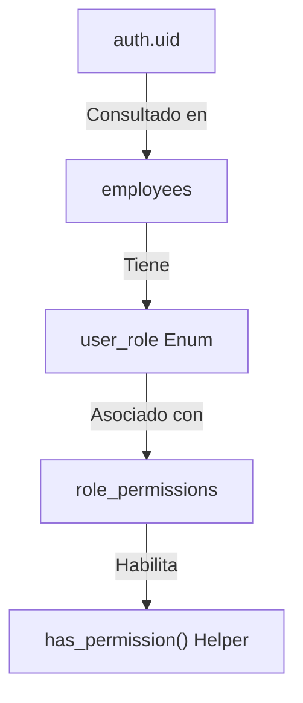

# J&M Fashion Retail ERP/POS — Arquitectura de Seguridad y Base de Datos (Hardening)

Este documento detalla la implementación de seguridad, consistencia transaccional y optimizaciones de consultas de base de datos para la plataforma **J&M Fashion Retail**.

---

## 1. Control de Acceso y Permisos (RBAC)

Se implementó un sistema desacoplado de roles y permisos mediante tablas relacionales dinámicas:

### Funciones Auxiliares SQL
* **`current_employee_branch()`**: Obtiene de manera segura el `branch_id` del empleado activo mediante `auth.uid()`.
* **`current_employee_role()`**: Obtiene el enum `user_role` del empleado activo.
* **`has_permission(p_permission)`**: Valida la existencia de permisos específicos para roles no administradores. Los roles `super_admin` y `admin` omiten las comprobaciones automáticamente.

---

## 2. Consistencia Transaccional y Concurrencia (SELECT FOR UPDATE)

Para evitar condiciones de carrera (**race conditions**), stock negativo o duplicidad de transacciones en la facturación y sincronización sin conexión, se implementó una función atómica central:

* **`create_sale_atomic()`**: 
  1. Adquiere un bloqueo de registro exclusivo en la tabla `inventories` utilizando la cláusula **`SELECT FOR UPDATE`**.
  2. Valida la suficiencia del inventario en tiempo de transacción.
  3. Inserta de forma atómica la cabecera en `sales` y las líneas asociadas en `sale_items`.
  4. Realiza la reducción del inventario mediante el disparador transaccional.

---

## 3. Disparadores Críticos (Triggers)

Se agregaron disparadores para blindar la operación contra estados inválidos en la caja registradora:

| Disparador | Tabla | Propósito |
| :--- | :--- | :--- |
| `check_double_shift` | `shifts` | Impide que un cajero abra un nuevo turno si ya tiene una caja activa abierta. |
| `check_double_close` | `shifts` | Bloquea actualizaciones sobre turnos de caja que ya se encuentran cerrados. |
| `check_sale_shift_active` | `sales` | Bloquea la inserción de ventas si el turno de caja referenciado está cerrado o inactivo. |
| `sale_deduct_inventory` | `sale_items` | Realiza el descuento atómico de existencias y emite advertencias si el stock baja del umbral mínimo de reabastecimiento. |

---

## 4. Políticas Row-Level Security (RLS)

Se aplicó el endurecimiento (**hardening**) de datos en todas las tablas mediante directivas estrictas de aislamiento:

* **Aislamiento Multi-Sucursal:** Los cajeros, supervisores y personal de bodega están aislados a su sucursal de pertenencia determinada por `current_employee_branch()`.
* **Segregación de Operaciones:**
  * **Inventarios:** Lectura restringida a la sucursal del empleado; modificaciones autorizadas solo para roles con permiso `inventories:write`.
  * **Ventas:** Inserciones restringidas a cajeros con turnos abiertos en su propia sucursal.
  * **Auditoría:** Consultas exclusivas para `super_admin` y `admin`.

---

## 5. Optimizaciones y Vistas Materializadas

### Índices de Alta Densidad (<50ms en POS)
* `idx_variants_barcode` y `idx_variants_sku`: Búsquedas ultrarrápidas de prendas al escanear o digitar SKUs.
* `idx_inventories_branch_variant`: Acelera la validación de inventario durante el cobro.
* `idx_sales_invoice_number`: Búsquedas inmediatas de facturas para devoluciones.

### Análisis Ejecutivo (Vistas Materializadas)
Para evitar penalizar el rendimiento del servidor en consultas analíticas complejas, se crearon vistas indexadas:
* **`mv_daily_sales`**: Agregaciones diarias de facturas y descuentos por sucursal.
* **`mv_monthly_sales`**: Consolidaciones mensuales de ingresos netos.
* **`mv_top_products`**: Escalafón con los artículos más vendidos.
* **`refresh_analytics_views()`**: Procedimiento almacenado para refrescar las vistas analíticas de forma concurrente sin bloquear lecturas de usuarios activos.
